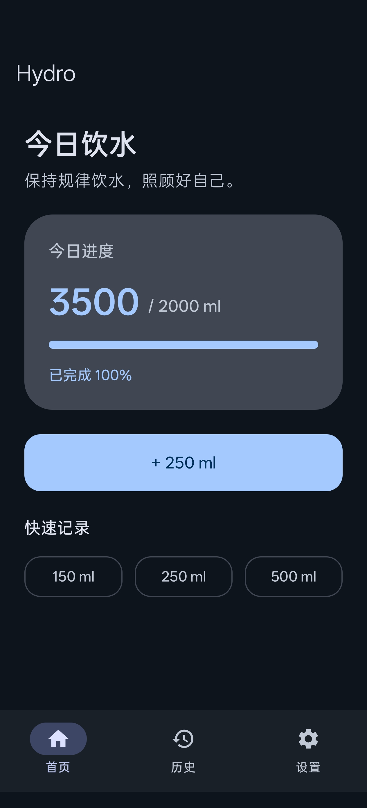
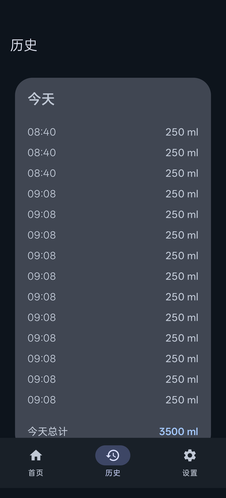
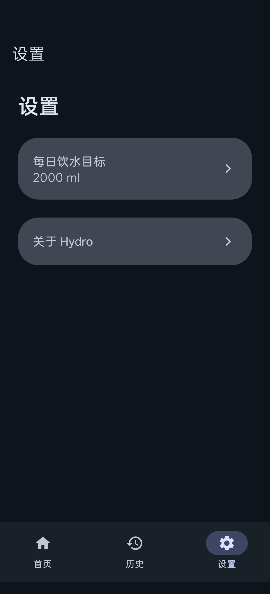

# Hydro 💧

一个简单、清爽的 Android 饮水记录 App。

记录每天喝了多少水，看看自己有没有达到今日目标。

A small and simple water tracking app for Android.

## Features

- 快速记录饮水量
- 自定义每日饮水目标
- 查看今日饮水进度
- 查看历史饮水记录
- 本地持久化保存数据
- 支持深色模式
- 每日自动重置饮水进度
- 撤回上一次饮水记录
- Material Design 3 界面

## Screenshots

| 首页 | 历史 | 设置 |
| --- | --- | --- |
|  |  |  |

## Download

当前版本为 [v1.1.0](../../releases/tag/v1.1.0)。

## Built With

- Kotlin
- Jetpack Compose
- Material 3
- Room
- DataStore

## About This Project

Hydro 是一个个人小项目。我想做一个简单的饮水记录工具，并从零开始尝试现代 Android 技术栈。

这个项目也是学习 Android 开发，以及尝试 Vibe Coding 的一个小实验。

## License

本项目使用 [MIT License](LICENSE)。

## Author

Yc-Cc21  
GitHub: [https://github.com/Yc-Cc21](https://github.com/Yc-Cc21)

Made with 💧 and a little bit of Vibe Coding.
